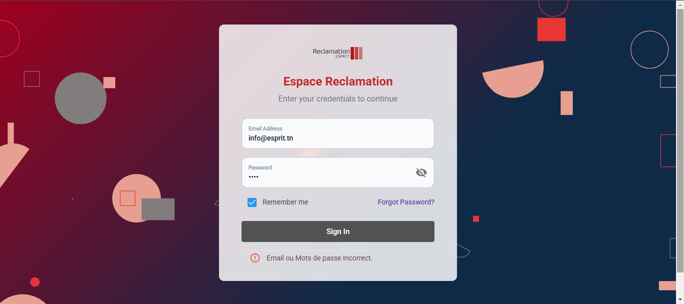
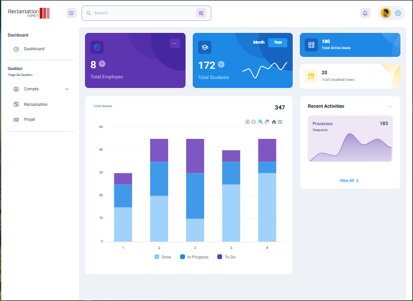
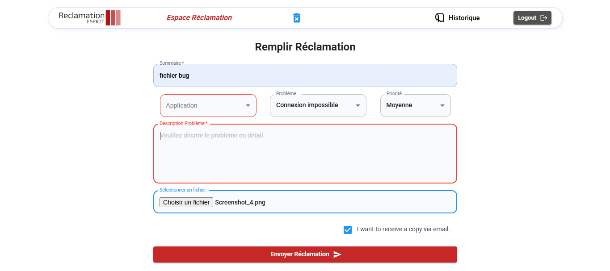
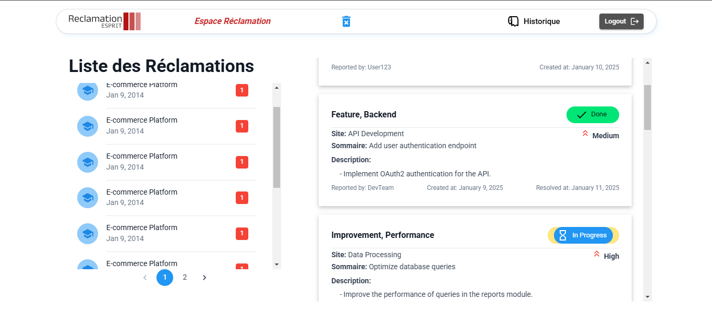
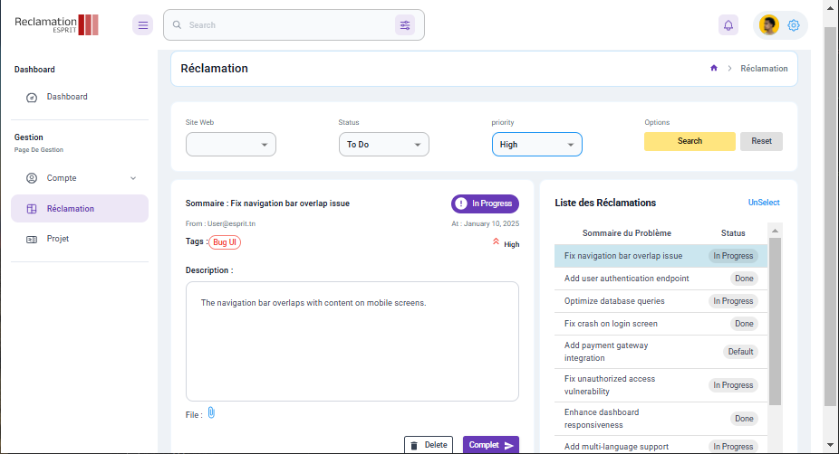
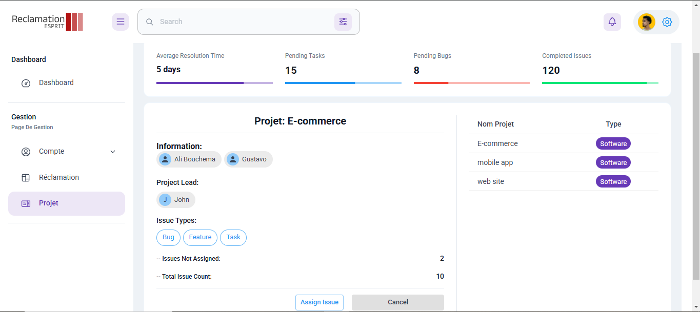

# **App**

## **SonarCloud Project Badges**

| **Metric**               | **Badge**                                                                                                                                                            |
|---------------------------|--------------------------------------------------------------------------------------------------------------------------------------------------------------------|
| **Overall**              |     |
| **Quality Gate Status**  |  |
| **Bugs**                 |                     |
| **Code Smells**          |       |
| **Duplicated Lines (%)** |  |
| **Security Rating**      |  |
| **Vulnerabilities**      |  |
| **Maintainability Rating** |  |
| **Reliability Rating**   |  |

---

## **Prerequisites**

1. Install **Node.js** and **npm** on your machine.
2. Have a **Jira account** and an active **Jira project**.

## **Dashboard Interface**

The dashboard provides an interactive view of project data and reclamations, featuring the following sections:

### **1. Reclamation Form**
- Allows users to submit complaints or feedback related to projects.
- Features include:
    - Dynamic form validation.
    - Attachments for supporting evidence.
    - Category selection for reclamations.

### **2. Logs**
- Displays system and project-related logs.
- Logs include timestamps, user actions, and status updates.
- Supports filtering by project, user, or log type.

### **3. Managing Reclamations**
- Admin interface for handling submitted reclamations.
- Options for assigning, updating statuses, or closing reclamations.
- Provides detailed reclamation history for auditing purposes.

### **4. Projects Management**
- Lists all active and archived projects.
- Displays issue counts ("Done," "In Progress," "To Do").
- Interactive project actions, such as assigning team members or tracking progress.

### **5. Login**
- Secure authentication system using JWT.
- Role-based access control for users (e.g., Admin, Team Member, Viewer).
- Includes a password recovery and account management system.

---

## **Screenshots**

### Login

### Dashboard Overview

### Reclamation Form

### Logs

### Managing Reclamations

### Projects Management

---
